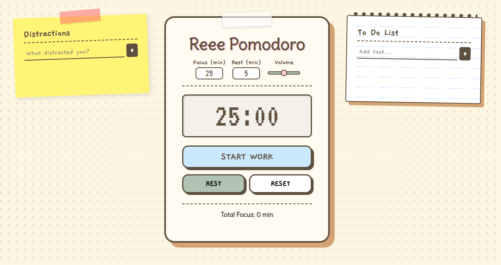

# ⏱️ Reee Pomodoro

Aplikasi **Pomodoro Timer interaktif** berbasis **HTML, CSS, dan JavaScript (Vanilla)** dengan tampilan **playful, hand-drawn, dan paper-style UI**.  
Aplikasi ini menggabungkan **Pomodoro Timer**, **To-Do List**, dan **Distraction List** dalam satu halaman untuk membantu fokus dan produktivitas.

---

## 🚀 Live Preview

> https://revanyangel.github.io/simple-homepage/

  

---

## ✨ Fitur Utama

### ⏳ Pomodoro Timer
- Mode **Work** & **Rest**
- Durasi **custom (menit)**
- Tombol **Start / Pause / Resume / Reset**
- **Alarm suara** dengan pengaturan volume
- **Notifikasi browser** saat waktu habis
- Statistik **Total Focus Time**

### 📝 To-Do List
- Tambah & hapus task
- Tandai task selesai (checkbox)
- Animasi saat task selesai
- **Drag & drop** untuk mengatur urutan

### 🚫 Distraction List
- Catat hal-hal yang mengganggu fokus
- Drag & drop antar item
- Tampilan seperti **sticky note**

---

## 🎨 Desain & UI

- Paper & stationery style
- Warna pastel yang lembut
- Font handwritten:
  - **Delius**
  - **Gaegu**
  - **VT323**
- Responsive (desktop & mobile)
- Animasi ringan dan smooth

---

## 🛠️ Teknologi yang Digunakan

- **HTML5** — struktur aplikasi
- **CSS3** — styling, animasi, dan custom UI
- **JavaScript (Vanilla JS)** — logika timer & interaksi
- **Web Audio API** — alarm timer
- **Browser Notification API**

---

> Semua kode (HTML, CSS, dan JavaScript) berada dalam **satu file**.

---

## 🚀 Cara Menjalankan

1. Download atau clone project
2. Buka file `index.html` di browser modern (Chrome / Edge / Firefox)
3. Izinkan **notifikasi browser** saat diminta
4. Aplikasi siap digunakan 🎉

---

## 🧠 Cara Kerja Singkat

- Timer berbasis **`setInterval` + timestamp**
- Alarm menggunakan **Oscillator (Web Audio API)**
- Volume dikontrol melalui **range slider**
- To-do & distraction list dikelola melalui **DOM manipulation**
- Drag & drop menggunakan **HTML Drag and Drop API**
